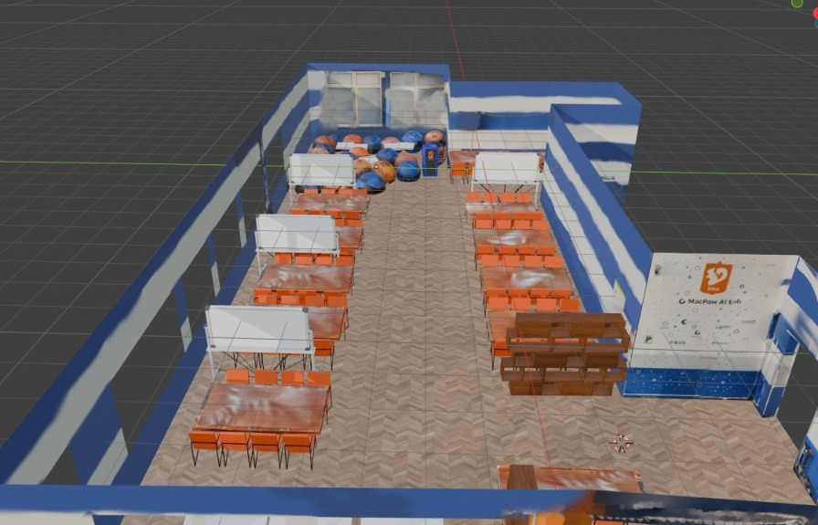

# MetaLab

**Віртуальний навчальний простір у VRChat** для метавсесвіту NEXT-Study.

Номінація I · Erasmus+ NEXT Student Creative Project Competition  
КПІ ім. Ігоря Сікорського · тімлід **Павленко Святослав**

[Відкрити світ](https://vrchat.com/home/world/wrld_b1c73436-f022-4f98-9172-671f9f0da989/info) · [Презентація UK](docs/presentation/MetaLab-NEXT-UK.pdf) · [Презентація EN](docs/presentation/MetaLab-NEXT-EN.pdf)

  

MetaLab переносить **MacPaw AI Lab** у VRChat: семінарські ряди, дошки, lounge і робочі станції в одній багатокористувацькій залі. Студенти проводять практику, хакатони й екскурсії з ефектом присутності — без сітки вікон відеозв’язку.

## Для комісії

| | |
| --- | --- |
| Світ VRChat | https://vrchat.com/home/world/wrld_b1c73436-f022-4f98-9172-671f9f0da989/info |
| Презентація (UK) | [docs/presentation/MetaLab-NEXT-UK.pdf](docs/presentation/MetaLab-NEXT-UK.pdf) |
| Презентація (EN) | [docs/presentation/MetaLab-NEXT-EN.pdf](docs/presentation/MetaLab-NEXT-EN.pdf) |
| Ідея | [docs/CONCEPT.md](docs/CONCEPT.md) |
| Як зайти у світ | [docs/VRCHAT.md](docs/VRCHAT.md) |
| Технічна реалізація | [docs/ARCHITECTURE.md](docs/ARCHITECTURE.md) |
| Сценарій захисту | [docs/DEMO.md](docs/DEMO.md) |
| Unity | [`unity/`](unity/) · сцена `Assets/Scenes/MetaLab_Main.unity` |

## Стек

Unity **2022.3.22f1** · VRChat SDK3 · UdonSharp (C#) · Blender · Substance 3D Painter · PBR · light baking

Відкрийте `unity/` у VRChat Creator Companion. Пакети VPM підтягнуться з `Packages/manifest.json`.

## Команда

| | Роль |
| --- | --- |
| **Павленко Святослав** | Team Lead |
| Ільєнко Денис | 3D · ретопологія |
| Пошитнюк Дмитро | PBR · матеріали |
| Маменко Марк | UdonSharp · мережа |
| Шозда Катерина | QA · VR |

Повний розподіл: [AUTHORS.md](AUTHORS.md)

---

### English

**Nomination I** — a MacPaw AI Lab space on VRChat for the NEXT-Study Metaverse. Seminar rows, critique boards, lounge and workstations in one multiplayer room. Team lead: **Sviatoslav Pavlenko**. Official-template PDFs in `docs/presentation/`. World link above.
