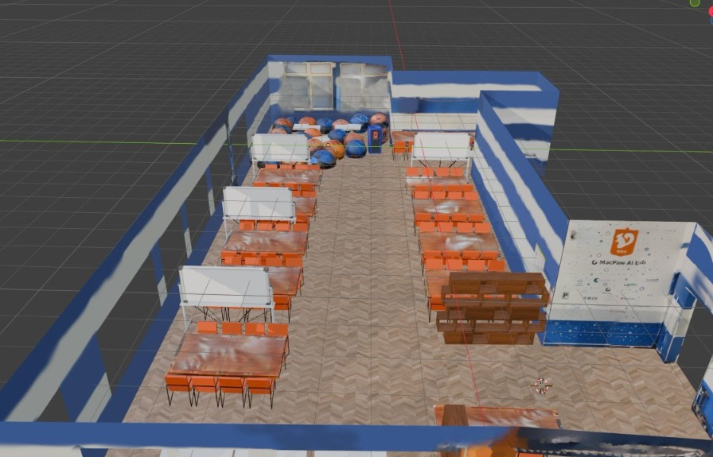

# MetaLab

Віртуальна зала **MacPaw AI Lab** у VRChat для метавсесвіту NEXT-Study.

Номінація I · Erasmus+ NEXT · КПІ ім. Ігоря Сікорського · тімлід **Павленко Святослав**  
Парний проєкт ментора: [CodeSensei](https://github.com/mamenkomarkus-creator/CodeSensei)

[Відкрити світ](https://vrchat.com/home/world/wrld_b1c73436-f022-4f98-9172-671f9f0da989/info) · [Відео](presentation-materials/demo-video.mp4) · [Презентація UK](presentation-materials/MetaLab-NEXT-UK.pdf) · [Презентація EN](presentation-materials/MetaLab-NEXT-EN.pdf) · [Документація](presentation-materials/documentation/DOCUMENTATION.md)

  

## Склад команди

| Ім’я | Роль |
| --- | --- |
| **Павленко Святослав** | Team lead · координація, збірка світу |
| Ільєнко Денис | 3D · ретопологія |
| Пошитнюк Дмитро | PBR · матеріали |
| Маменко Марк | UdonSharp · мережа |
| Шозда Катерина | QA / VR |

[AUTHORS.md](AUTHORS.md)

## 1. Анотація

У рамках конкурсу NEXT ми зібрали цифровий двійник університетської лабораторії MacPaw AI Lab у VRChat: семінарські ряди, lounge, дошки й робочі місця в одній багатокористувацькій залі. Світ опубліковано — група може проводити практику й екскурсії з ефектом присутності, а не в сітці вікон Zoom.

## 2. Вступ

Розробку створено в середовищі **Unity 2022.3.22f1** + **VRChat SDK3 Worlds**, з логікою **UdonSharp (C#)**. Геометрія — **Blender** (ретопологія під ліміти VRChat), матеріали — **Substance 3D Painter (PBR)**, світло — **light baking** у Unity. Референс — реальна зала MacPaw AI Lab у КПІ.

## 3. Практична частина

- Планування зали: семінар, lounge з пуфами, сусідній відсік, робочі столи.
- Колізії на підлозі, столах і стінах; спавни та аудіозони SDK3.
- Запечене світло замість realtime, щоб тримати FPS у шоломі.
- Логотип MacPaw AI Lab на стіні — растрове зображення з референсу лабораторії, не згенерований сток.
- Інтерактив UdonSharp (екрани, тригери, синхронізація між гравцями); місце під модуль CodeSensei.
- Як зайти: VRChat PC/PCVR, світ [wrld_b1c73436-…](https://vrchat.com/home/world/wrld_b1c73436-f022-4f98-9172-671f9f0da989/info). Сцена: `unity/Assets/Scenes/MetaLab_Main.unity` у Creator Companion. Для термінала CodeSensei — **Allow Untrusted URLs**.

## 4. Труднощі та ліміти

Баланс полігонів і матеріалів із візуальною точністю. Baking замість динамічного світла. FPS, щоб уникати заколисування. Мережа інтерактивних пропів без розвалу інстансу. Quest — лише в межах того, що витягне сцена.

## 5. Подальший розвиток

Підключення AI-ментора CodeSensei як постійного префаба, симулятори мереж через OSC/HTTP, модульні одиниці обладнання, окрема збірка під Quest.

---

# English

Digital twin of **MacPaw AI Lab** in VRChat for Erasmus+ NEXT (Nomination I). Team lead: **Sviatoslav Pavlenko**. Paired mentor: [CodeSensei](https://github.com/mamenkomarkus-creator/CodeSensei).

## 1. Annotation

For the contest we published a multiplayer VRChat rebuild of our university lab — seminar rows, lounge, boards, workstations — so a group shares one room instead of a video grid.

## 2. Introduction

Built in **Unity 2022.3.22f1** and **VRChat SDK3** with **UdonSharp**, **Blender** (retopo), **Substance 3D Painter** (PBR), and **baked lighting**. Reference: the real MacPaw AI Lab at KPI.

## 3. Practical part

Retopo’d mesh, baked lights, collisions, SDK3 spawns, raster MacPaw AI Lab wall logo from our lab photos, UdonSharp sync. World ID `wrld_b1c73436-f022-4f98-9172-671f9f0da989`. Scene `unity/Assets/Scenes/MetaLab_Main.unity`.

## 4. Difficulties and limits

Polygon/material budget, baking vs realtime, headset FPS, networked props, Quest limits.

## 5. Further development

Permanent CodeSensei prefab, OSC/HTTP simulators, modular equipment, Quest-oriented build.
