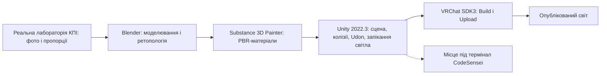
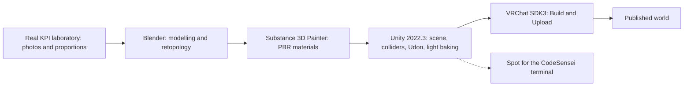

# MetaLab: VR-копія лабораторії MacPaw AI Lab у VRChat для метавсесвіту NEXT-Study

**Команда Bilka** · проєкт MetaLab  
Номінація I · Erasmus+ NEXT · КПІ ім. Ігоря Сікорського  
Тімлід: Павленко Святослав · парний ментор: [CodeSensei](https://github.com/mamenkomarkus-creator/CodeSensei) (команда KP_Devs)

Версія документа: 2026-10-08 · ревізія репозиторію під час аналізу: `4fec493` · дата аналізу: 2026-10-07 (UTC)

Світ: https://vrchat.com/home/world/wrld_b1c73436-f022-4f98-9172-671f9f0da989/info  
World ID: `wrld_b1c73436-f022-4f98-9172-671f9f0da989`

**Ключові слова:** VRChat, метавсесвіт, віртуальна лабораторія, Unity, UdonSharp, ретопологія, запечене освітлення.

## 1. Анотація

Дистанційна група зазвичай зустрічається в сітці вікон відеозв’язку, де немає спільного простору, спільних дошок і відчуття присутності поруч. Мета проєкту — перенести у віртуальну реальність конкретне фізичне місце: лабораторію MacPaw AI Lab у КПІ, щоб на практику, хакатон або екскурсію можна було зійтися в ній як у кімнаті.

Зала зібрана в Unity 2022.3.22f1 із VRChat SDK3 Worlds. Геометрія моделювалась у Blender з ретопологією під полігонний бюджет платформи, матеріали виконано як PBR у Substance 3D Painter, освітлення запечене в Unity, інтерактив написано на UdonSharp. Світ опубліковано у VRChat. У залі залишено місце під термінал CodeSensei, AI-ментора з ООП.

З репозиторію сцени Unity виміряно: 22 об’єкти, 14 екземплярів префабів, 6 джерел світла, 2 lightmap-и 1024 × 1024 та 1 reflection probe. Показники продуктивності опублікованого світу (кількість трикутників, батчі, розмір збірки, кадрова частота в шоломі) у цьому документі не наведено, бо вони не були виміряні; протокол їх вимірювання подано в розділі 3.5.

## 2. Вступ

### 2.1 Контекст і інструменти

Розробка велася в **Unity 2022.3.22f1** з **VRChat SDK3 Worlds**. Інтерактив написано на **UdonSharp (C#)**. Геометрію зали, меблів і обладнання зібрано в **Blender** і спрощено ретопологією, щоб укластися в бюджет платформи й не втрачати кадри в шоломі. Матеріали — **PBR у Adobe Substance 3D Painter**. Світло запечене в Unity (light baking), тож шолом не обчислює набір realtime-ламп щокадру.

Референс — реальна зала MacPaw AI Lab у КПІ. Кадри в папці `presentation-materials/lab/` зняті з нашої сцени: загальний план, lounge, сусідній відсік і семінар. Проєкт відкривається через VRChat Creator Companion з папки `unity/`.

### 2.2 Мета і завдання

**Мета:** відтворити конкретну університетську лабораторію як багатокористувацький простір для практичних занять, хакатонів і екскурсій у метавсесвіті NEXT-Study.

**Завдання:**

1. Відтворити планування й пропорції реальної зали, а не абстрактний «офіс майбутнього».
2. Вкластися в бюджет VRChat за полігонами, матеріалами й освітленням, щоб утримати кадрову частоту в шоломі.
3. Синхронізувати між гравцями інстанса стан інтерактивних об’єктів.
4. Залишити в залі місце під термінал CodeSensei.
5. Описати проєкт так, щоб його параметри можна було перевірити за репозиторієм.

### 2.3 Команда

Команда з п’яти осіб. Координація і збірка світу — Павленко Святослав. Моделі й ретопологія — Ільєнко Денис. PBR і матеріали Unity — Пошитнюк Дмитро. Мережевий інтерактив UdonSharp — Маменко Марк. Перевірка в шоломі, колізії і стабільність — Шозда Катерина.

## 3. Практична частина

### 3.1 З чого складається зала

Семінарські столи з помаранчевими стільцями, маркерні дошки, стелажі, робочі місця й lounge з круглими пуфами. Є сусідній відсік з окремими столами. Пропорції взято з реальної лабораторії. На торцевій стіні — логотип MacPaw AI Lab: це растрове зображення з референсу нашої лабораторії, не згенерована картинка.

Колізії стоять на підлозі, столах і стінах, щоб аватар не провалювався крізь меблі. SDK3 забезпечує точки появи й аудіозони. Стан інтерактивних об’єктів синхронізується через UdonSharp, тож перемикач або екран, який зачепив один гравець, бачать інші в тому самому інстансі. Окреме місце залишено під термінал **CodeSensei**: зала без нього придатна для зустрічі, а з ним у тому самому просторі з’являється практика з коду.

### 3.2 Конвеєр створення

Шлях від фізичної кімнати до опублікованого світу показано на рис. 1.

*Рис. 1. Конвеєр створення світу MetaLab.*

Рішення на кожному кроці пов’язані з обмеженнями платформи (таблиця 1).

*Таблиця 1. Обмеження VRChat і відповідні рішення*

| Обмеження | Джерело | Рішення |
| --- | --- | --- |
| Бюджет полігонів, матеріалів і розміру світу. Для Quest рекомендовано близько 250 000 трикутників на весь світ, збірку до 100 МБ після стиснення, текстури до 1024 × 1024 | документація VRChat [1] | Ретопологія меблів і обладнання в Blender; повторювані об’єкти збираються з однакових префабів |
| Realtime-світло дороге; для Quest запікання вважається обов’язковим [1] | [1] | Світло запечене: у сцені збережено 2 lightmap-и 1024 × 1024 і reflection probe |
| Синхронізувати можна лише стан, описаний в Udon; зайві синхронізовані об’єкти роздувають інстанс | практика SDK3 | Синхронізується лише стан інтерактивних об’єктів |
| Зовнішні адреси поза списком довірених потребують дозволу гравця (для CodeSensei) | VRChat, *String Loading* [2] | Гравець вмикає «Allow Untrusted URLs» і перезаходить |
| Quest потребує окремої збірки | [1] | У залежності проєкту включено Easy Quest Switch; окремий прохід по сцені відкладено (розділ 5) |

### 3.3 Середовище і версії

*Таблиця 2. Версії інструментів і пакетів (з `unity/ProjectSettings` і `unity/Packages/vpm-manifest.json`)*

| Компонент | Версія |
| --- | --- |
| Unity | 2022.3.22f1 |
| VRChat SDK (Base, Worlds) | 3.10.5 |
| VPM resolver | 0.1.29 |
| AudioLink | 3.1.2 |
| Easy Quest Switch | 1.4.0 |
| VR World Toolkit | 3.4.1 |
| UdonSharp | у складі VRChat SDK Worlds |
| Blender, Substance 3D Painter | версії не зафіксовано в репозиторії |

### 3.4 Що виміряно в репозиторії

Статистику сцени `unity/Assets/Scenes/MetaLab_Main.unity` отримано скриптом [`scripts/scene_stats.py`](../../scripts/scene_stats.py), який читає YAML сцени без запуску Unity. Повний вивід: [`scene-stats-2026-10-07.json`](../../docs/evaluation/scene-stats-2026-10-07.json).

*Таблиця 3. Склад сцени `MetaLab_Main` у репозиторії*

| Показник | Значення |
| --- | --- |
| Об’єктів `GameObject` | 22 |
| Екземплярів префабів | 14 (4 різні префаби) |
| `MeshRenderer` / `MeshFilter` | 10 / 10 (усі меші сцени — вбудовані примітиви Unity) |
| Колайдерів | 9 `BoxCollider`, 1 `MeshCollider` |
| Джерел світла | 6: 5 точкових і 1 спрямоване |
| Lightmap-и | 2 × 1024 × 1024 (файли EXR: 2,65 і 1,19 МБ) |
| Reflection probe | 1 (`ReflectionProbe-0.exr`) |
| `MonoBehaviour` | 8 |
| Розмір файлу сцени | 224 КБ |
| Каталог `unity/Assets` | 13,6 МБ |
| Матеріалів `.mat` у репозиторії | 7 |

Ці числа описують лише те, що лежить у репозиторії. Вони не є характеристиками опублікованого світу: 14 екземплярів префабів посилаються на 4 префаби, жодного з яких у репозиторії немає (скрипт перевіряє GUID у файлах `.meta`), а вихідних моделей Blender і текстур Substance у `unity/Assets` теж немає. Тому повний набір меблів, трикутники й матеріали зали за цим репозиторієм порахувати не можна, а опублікований світ не відтворюється зі збірки з нуля.

### 3.5 Бюджет і якість: показники та їхній стан

Для кожного показника наведено орієнтир платформи, значення і стан вимірювання. Протокол і шаблони для заповнення — у [`docs/evaluation/README.md`](../../docs/evaluation/README.md).

*Таблиця 4. Показники бюджету та якості*

| Показник | Орієнтир | Значення | Стан |
| --- | --- | --- | --- |
| Lightmap-и | низька роздільність [1] | 2 × 1024² | виміряно |
| Reflection probe | — | 1 | виміряно |
| Кількість світла | мінімум realtime [1] | 6 (5 точкових, 1 спрямоване) | виміряно; режим кожного світла (Realtime / Mixed / Baked) потрібно підтвердити в Inspector |
| Трикутники в опублікованому світі | Quest ≈ 250 000 [1] | — | не виміряно |
| Батчі, SetPass calls, кількість матеріалів | мінімізувати [1] | — | не виміряно |
| Розмір збірки після стиснення | Quest ≤ 100 МБ [1] | — | не виміряно |
| Ретопологія: трикутники до і після (Blender) | — | — | дані не надано |
| Кадрова частота в шоломі (середня і 1 % low) | частота оновлення шолома | — | не виміряно |
| Перевірка колізій і мережі (чекліст Шозди Катерини) | — | — | результати не надано |

### 3.6 Як відкрити і перевірити

1. Встановити VRChat на PC або PCVR ([hello.vrchat.com](https://hello.vrchat.com/)).
2. Увійти в акаунт і відкрити [світ](https://vrchat.com/home/world/wrld_b1c73436-f022-4f98-9172-671f9f0da989/info).
3. Для термінала CodeSensei ввімкнути **Settings → Security → Allow Untrusted URLs** і перезайти.

У редакторі: додати `unity/` у VRChat Creator Companion, дочекатися пакетів VPM і відкрити сцену `Assets/Scenes/MetaLab_Main.unity`. Статистика сцени: `python3 scripts/scene_stats.py`. Короткий шлях заходу також у [VRCHAT.md](VRCHAT.md).

## 4. Труднощі та ліміти (загрози валідності)

**Бюджет сцени.** VRChat жорстко обмежує полігони, матеріали й розмір світу. Детальна копія кожного стільця «як у CAD» не проходить, тому сітку спрощено ретопологією; інакше кадри в шоломі падають і з’являється заколисування.

**Світло.** Динамічні лампи виглядають живіше, але у VR вони дорогі. Запечене світло стабільніше, зате після зсуву меблів заливання треба перепікати. У збереженій сцені є результати запікання (lightmap-и, probe), але режим кожної з 6 ламп варто перевірити в редакторі, бо від цього залежить твердження, що realtime-ламп у шоломі немає.

**Мережа.** Інтерактив не переноситься зі звичайного Unity «як є»; синхронізувати можна лише те, що описано в Udon.

**Quest.** Поточна сцена розрахована на PC і PCVR. Окрема мобільна збірка потребує ще одного проходу по полігонах і текстурах.

**Зовнішні URL.** Якщо в залі стоїть CodeSensei, VRChat не пропустить запит на сервер, доки гравець не дозволить ненадійні адреси.

**Валідність і відтворюваність.** Продуктивність опублікованого світу (трикутники, батчі, розмір збірки, кадрова частота) не вимірювалася, тож твердження про те, що зала «вкладається в бюджет», поки підтверджене лише якісно: світ опубліковано й відкривається. Репозиторій не містить вихідних моделей, текстур і 4 префабів, на які посилається сцена, тому збірку не можна відтворити з нуля. Версії Blender і Substance не зафіксовані. Перевірку в шоломі виконувала одна людина, результатів у репозиторії немає. Усі виміряні числа в таблиці 3 стосуються файлів репозиторію, а не збірки.

## 5. Подальший розвиток

1. Виміряти показники таблиці 4 за протоколом (трикутники, батчі, розмір збірки, кадрова частота) і додати значення в цей документ.
2. Зберегти ретопологію «до і після» для кількох типових об’єктів (кількість трикутників) і додати до документа.
3. Додати у репозиторій або в окреме сховище вихідні моделі, текстури й відсутні префаби та зафіксувати версії Blender і Substance, щоб збірка відтворювалась.
4. Підтвердити режим запікання ламп у Unity й за потреби перепекти світло.
5. Поставити термінал CodeSensei в залі як постійний префаб.
6. Додати прості симулятори мереж через OSC або HTTP, не ламаючи бюджет сцени, і нарізати обладнання модульними префабами.
7. Зробити прохід під Quest. Оформити публічну картку світу для екскурсій абітурієнтів.

## Джерела

1. VRChat Creators. *Quest Content Optimization*. https://creators.vrchat.com/platforms/android/quest-content-optimization (дата звернення: 2026-10-07).
2. VRChat Creators. *String Loading*. https://creators.vrchat.com/worlds/udon/string-loading/ (дата звернення: 2026-10-07).

---

# English

# MetaLab: a VR copy of the MacPaw AI Lab laboratory in VRChat for the NEXT-Study metaverse

**Team Bilka** · project MetaLab  
Nomination I · Erasmus+ NEXT · Igor Sikorsky Kyiv Polytechnic Institute  
Team lead: **Sviatoslav Pavlenko** · paired mentor: [CodeSensei](https://github.com/mamenkomarkus-creator/CodeSensei) (team KP_Devs)

Document version: 2026-10-08 · repository revision analysed: `4fec493` · analysis date: 2026-10-07 (UTC)

**Keywords:** VRChat, metaverse, virtual laboratory, Unity, UdonSharp, retopology, baked lighting.

## 1. Annotation

A remote group usually meets in a grid of video windows with no shared space, no shared boards, and no sense of being in the same place. The aim of this project is to carry a specific physical place into virtual reality, the MacPaw AI Lab laboratory at KPI, so that a group can meet in it for a practical, a hackathon, or a tour as in a real room.

The hall is built in Unity 2022.3.22f1 with VRChat SDK3 Worlds. Geometry was modelled in Blender and retopologised for the platform’s polygon budget, materials are PBR made in Substance 3D Painter, lighting is baked in Unity, and interaction is written in UdonSharp. The world is published in VRChat. Room has been left in the hall for the CodeSensei terminal, an AI mentor for OOP.

From the repository’s Unity scene we measured: 22 objects, 14 prefab instances, 6 light sources, 2 lightmaps of 1024 × 1024, and 1 reflection probe. Performance figures of the published world (triangle count, batches, build size, headset frame rate) are not given in this document because they were not measured; the measurement protocol is in section 3.5.

## 2. Introduction

### 2.1 Context and tools

Development used **Unity 2022.3.22f1** with **VRChat SDK3 Worlds**. Interaction is written in **UdonSharp (C#)**. The geometry of the hall, furniture, and equipment is built in **Blender** and simplified by retopology to fit the platform budget without losing frames in the headset. Materials are **PBR in Adobe Substance 3D Painter**. Lighting is baked in Unity, so the headset does not compute a set of realtime lamps every frame.

The reference is the real MacPaw AI Lab hall at KPI. The frames in `presentation-materials/lab/` are taken from our scene: overview, lounge, the adjacent bay, and the seminar. The project opens through the VRChat Creator Companion from the `unity/` folder.

### 2.2 Aim and objectives

**Aim:** reproduce a specific university laboratory as a multiplayer space for practicals, hackathons, and tours in the NEXT-Study metaverse.

**Objectives:**

1. Reproduce the layout and proportions of the real hall rather than an abstract “office of the future”.
2. Fit the VRChat budget for polygons, materials, and lighting to keep the headset frame rate.
3. Synchronise the state of interactive objects between the players of an instance.
4. Leave room in the hall for the CodeSensei terminal.
5. Describe the project so that its parameters can be checked against the repository.

### 2.3 Team

A team of five. Coordination and world assembly: Sviatoslav Pavlenko. Models and retopology: Denys Ilienko. PBR and Unity materials: Dmytro Poshytyniuk. UdonSharp network interaction: Mark Mamenko. Headset testing, colliders, and stability: Kateryna Shozda.

## 3. Practical part

### 3.1 What the hall consists of

Seminar tables with orange chairs, marker boards, shelves, workstations, and a lounge of round poufs. A neighbouring bay has separate desks. Proportions follow the real laboratory. The MacPaw AI Lab mark on the end wall is a raster taken from our laboratory reference, not a generated picture.

Colliders sit on the floor, tables, and walls so avatars do not fall through furniture. SDK3 provides spawn points and audio zones. The state of interactive objects is synchronised through UdonSharp, so a switch or a screen touched by one player is seen by the others in the same instance. A separate spot is kept for the **CodeSensei** terminal: the hall works as a meeting place without it, and with it the same space gains code practice.

### 3.2 Creation pipeline

Figure 1 shows the path from the physical room to the published world.

*Figure 1. The MetaLab world creation pipeline.*

The decision at each step follows a platform constraint (Table 1).

*Table 1. VRChat constraints and the corresponding decisions*

| Constraint | Source | Decision |
| --- | --- | --- |
| Budget for polygons, materials, and world size. For Quest, about 250,000 triangles for the whole world, a build up to 100 MB after compression, and textures up to 1024 × 1024 are recommended | VRChat documentation [1] | Retopology of furniture and equipment in Blender; repeated objects are built from identical prefabs |
| Realtime light is expensive; for Quest baking is considered essential [1] | [1] | Lighting is baked: the scene stores 2 lightmaps of 1024 × 1024 and a reflection probe |
| Only state described in Udon can be synchronised; extra synchronised objects bloat the instance | SDK3 practice | Only the state of interactive objects is synchronised |
| External addresses outside the trusted list need the player’s permission (for CodeSensei) | VRChat, *String Loading* [2] | The player enables “Allow Untrusted URLs” and rejoins |
| Quest needs a separate build | [1] | Easy Quest Switch is among the project dependencies; a separate pass over the scene is postponed (section 5) |

### 3.3 Environment and versions

*Table 2. Tool and package versions (from `unity/ProjectSettings` and `unity/Packages/vpm-manifest.json`)*

| Component | Version |
| --- | --- |
| Unity | 2022.3.22f1 |
| VRChat SDK (Base, Worlds) | 3.10.5 |
| VPM resolver | 0.1.29 |
| AudioLink | 3.1.2 |
| Easy Quest Switch | 1.4.0 |
| VR World Toolkit | 3.4.1 |
| UdonSharp | part of VRChat SDK Worlds |
| Blender, Substance 3D Painter | versions are not recorded in the repository |

### 3.4 What was measured in the repository

The statistics of the scene `unity/Assets/Scenes/MetaLab_Main.unity` were obtained with [`scripts/scene_stats.py`](../../scripts/scene_stats.py), which reads the scene YAML without launching Unity. Full output: [`scene-stats-2026-10-07.json`](../../docs/evaluation/scene-stats-2026-10-07.json).

*Table 3. Composition of the `MetaLab_Main` scene in the repository*

| Indicator | Value |
| --- | --- |
| `GameObject` count | 22 |
| Prefab instances | 14 (4 distinct prefabs) |
| `MeshRenderer` / `MeshFilter` | 10 / 10 (all scene meshes are Unity built-in primitives) |
| Colliders | 9 `BoxCollider`, 1 `MeshCollider` |
| Light sources | 6: 5 point and 1 directional |
| Lightmaps | 2 × 1024 × 1024 (EXR files: 2.65 and 1.19 MB) |
| Reflection probe | 1 (`ReflectionProbe-0.exr`) |
| `MonoBehaviour` | 8 |
| Scene file size | 224 KB |
| `unity/Assets` directory | 13.6 MB |
| `.mat` materials in the repository | 7 |

These numbers describe only what is in the repository. They are not characteristics of the published world: the 14 prefab instances refer to 4 prefabs, none of which is in the repository (the script checks the GUIDs in `.meta` files), and the source Blender models and Substance textures are not in `unity/Assets` either. The full set of furniture, the triangles, and the materials of the hall therefore cannot be counted from this repository, and the published world cannot be rebuilt from it from scratch.

### 3.5 Budget and quality: indicators and their status

For each indicator we give the platform reference, the value, and the measurement status. The protocol and fill-in templates are in [`docs/evaluation/README.md`](../../docs/evaluation/README.md).

*Table 4. Budget and quality indicators*

| Indicator | Reference | Value | Status |
| --- | --- | --- | --- |
| Lightmaps | low resolution [1] | 2 × 1024² | measured |
| Reflection probe | — | 1 | measured |
| Light count | minimise realtime [1] | 6 (5 point, 1 directional) | measured; the mode of each light (Realtime / Mixed / Baked) must be confirmed in the Inspector |
| Triangles in the published world | Quest ≈ 250,000 [1] | — | not measured |
| Batches, SetPass calls, material count | minimise [1] | — | not measured |
| Compressed build size | Quest ≤ 100 MB [1] | — | not measured |
| Retopology: triangles before and after (Blender) | — | — | data not provided |
| Headset frame rate (mean and 1 % low) | headset refresh rate | — | not measured |
| Collider and network check (Kateryna Shozda’s checklist) | — | — | results not provided |

### 3.6 How to open and check

1. Install VRChat on PC or PCVR ([hello.vrchat.com](https://hello.vrchat.com/)).
2. Sign in and open the [world](https://vrchat.com/home/world/wrld_b1c73436-f022-4f98-9172-671f9f0da989/info).
3. For the CodeSensei terminal, enable **Settings → Security → Allow Untrusted URLs** and rejoin.

In the editor: add `unity/` to the VRChat Creator Companion, wait for the VPM packages, and open the scene `Assets/Scenes/MetaLab_Main.unity`. Scene statistics: `python3 scripts/scene_stats.py`. The short entry path is also in [VRCHAT.md](VRCHAT.md).

## 4. Difficulties and limits (threats to validity)

**Scene budget.** VRChat strictly limits polygons, materials, and world size. A CAD-accurate copy of every chair does not pass, so the mesh is simplified by retopology; otherwise the frame rate in the headset drops and motion sickness appears.

**Lighting.** Dynamic lamps look livelier but are expensive in VR. Baked light is more stable, but after furniture is moved the lighting must be rebaked. The saved scene contains bake results (lightmaps, probe), but the mode of each of the 6 lamps should be checked in the editor, because the claim that no realtime lamps run in the headset depends on it.

**Networking.** Interaction does not carry over from ordinary Unity as it is; only what is described in Udon can be synchronised.

**Quest.** The current scene targets PC and PCVR. A separate mobile build needs another pass over polygons and textures.

**External URLs.** If CodeSensei stands in the hall, VRChat does not let the request out to the server until the player allows untrusted addresses.

**Validity and reproducibility.** The performance of the published world (triangles, batches, build size, frame rate) was not measured, so the claim that the hall fits the budget is so far supported only qualitatively: the world is published and opens. The repository does not contain the source models, textures, and the 4 prefabs the scene refers to, so the build cannot be reproduced from scratch. The Blender and Substance versions are not recorded. The headset check was done by one person and no results are in the repository. All measured numbers in Table 3 concern repository files, not the build.

## 5. Further development

1. Measure the indicators of Table 4 by the protocol (triangles, batches, build size, frame rate) and add the values to this document.
2. Keep retopology “before and after” triangle counts for several typical objects and add them to the document.
3. Add the source models, textures, and missing prefabs to the repository or to separate storage, and record the Blender and Substance versions, so that the build is reproducible.
4. Confirm the baking mode of the lamps in Unity and rebake the lighting if needed.
5. Keep the CodeSensei terminal in the hall as a permanent prefab.
6. Add small network simulators over OSC or HTTP without breaking the scene budget, and split equipment into modular prefabs.
7. Make a Quest pass. Publish a public world listing for applicant tours.

## References

1. VRChat Creators. *Quest Content Optimization*. https://creators.vrchat.com/platforms/android/quest-content-optimization (accessed 2026-10-07).
2. VRChat Creators. *String Loading*. https://creators.vrchat.com/worlds/udon/string-loading/ (accessed 2026-10-07).
